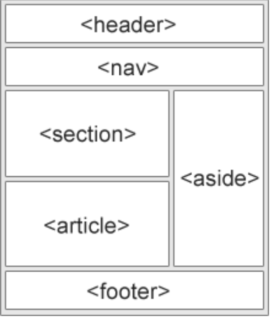
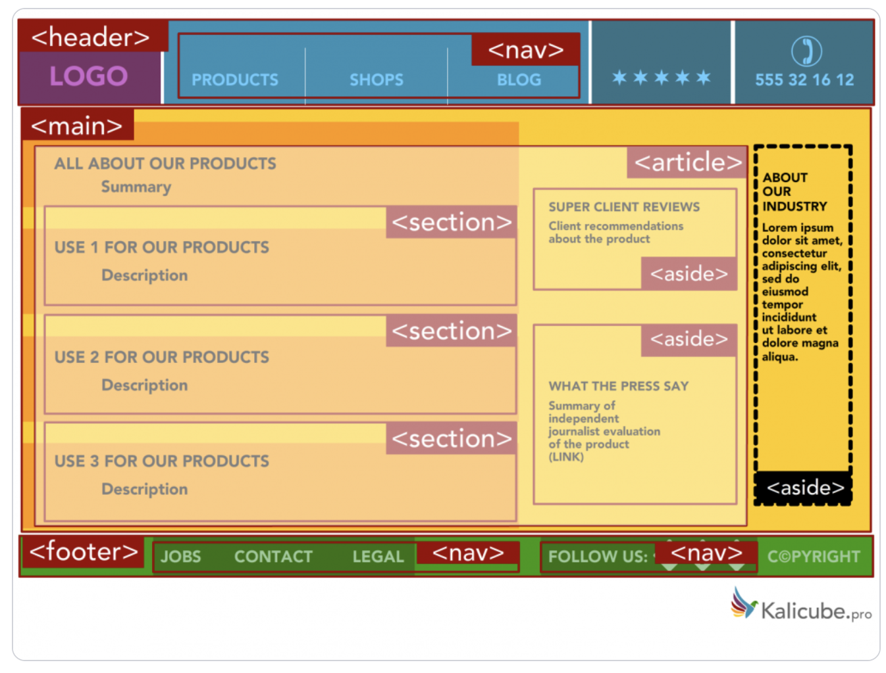

# <01 HTML, CSS, and Git Project: Code Refactor>

## Description

This is my very first HTML & CSS and Git project using HTML and CSS. It is a refactoring project that I changed the existing code in HTML and CSS to improve the web accessibility for Horiseon. 

The Horiseon webpage includes a header image, a navigation bar, three sections for describing their business, three sections for describing their business benefits, and a footer. Most of the content in their original HTML are not well-organized, and their CSS has many repetition parts because of the confusion of the class defined in HTML. 

My goals are improving the readability of HTML and the efficiency of CSS by consolidating the elements, class, and attributes followed semantic structure including comments for every changes. 

What I did in this project:

* Change HTML elements in semantic structure.

* Make HTML elements follow logical structure with independent of styling and positioning in CSS.

* Combine the repetition content in CSS and change CSS element order based on HTML.

* Change the heading attributes order.

* Make the title more detailed.

* Delete repeated classes and elements.

* Add comments on what I did to refactor the code.

* Create project folder and deploy it to GitHub.

What I learned after finishing the project is the importance of logical and rational coding for web development and maintenance, and the importance of comment lines and README in code refactor.   


## Installation

* Log in to github account.

* The URL of the deployed application:
<href:https://lijing-code.github.io/HW-01-Code-Refactor/>

* The URL of the GitHub repository:
<href:https://github.com/lijing-code/HW-01-Code-Refactor.git>


## Usage

* Instructions:
    ```md
    
    ```
* Semantic Elements:
    ```md
    
    ```
    ```md
    
    ```

## Credits

How to Write a Good README by Hillary Nyakundi <href:https://www.freecodecamp.org/news/how-to-write-a-good-readme-file/>

Professional README Guide
<href:https://coding-boot-camp.github.io/full-stack/github/professional-readme-guide>

Git Push and Pull by Olivia Smith
<href:https://www.datacamp.com/community/tutorials/git-push-pull>

HTML Semantic Elements
<href:https://www.w3schools.com/html/html5_semantic_elements.asp>

HTML5 Semantic Tags: What They Are and How to Use Them! by Jason Barnard3
<href:https://www.semrush.com/blog/semantic-html5-guide/>


## License
MIT License

Copyright (c) [2021] [Jing Li]

Permission is hereby granted, free of charge, to any person obtaining a copy
of this software and associated documentation files (the "Software"), to deal
in the Software without restriction, including without limitation the rights
to use, copy, modify, merge, publish, distribute, sublicense, and/or sell
copies of the Software, and to permit persons to whom the Software is
furnished to do so, subject to the following conditions:

The above copyright notice and this permission notice shall be included in all
copies or substantial portions of the Software.

THE SOFTWARE IS PROVIDED "AS IS", WITHOUT WARRANTY OF ANY KIND, EXPRESS OR
IMPLIED, INCLUDING BUT NOT LIMITED TO THE WARRANTIES OF MERCHANTABILITY,
FITNESS FOR A PARTICULAR PURPOSE AND NONINFRINGEMENT. IN NO EVENT SHALL THE
AUTHORS OR COPYRIGHT HOLDERS BE LIABLE FOR ANY CLAIM, DAMAGES OR OTHER
LIABILITY, WHETHER IN AN ACTION OF CONTRACT, TORT OR OTHERWISE, ARISING FROM,
OUT OF OR IN CONNECTION WITH THE SOFTWARE OR THE USE OR OTHER DEALINGS IN THE
SOFTWARE.
